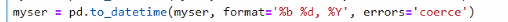
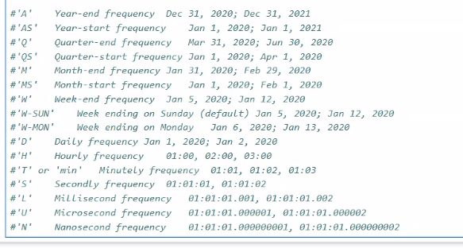
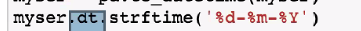
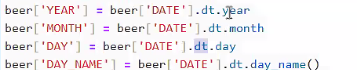
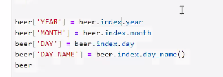

# dataScience-Lec10-06-APR-25
End of pandas, start of graphs
* Time functions: presentation 22
  * to_datetime: convert string to dateTime 
    * if it's not in the right format,to convert seiers of string to dateTime object, need to convert to the right format with optional parameter:
      * pd.to_datetime(s,format='%d--%m--%y')
      
      * b= month in word
      * M= month
      * m=minutes
      * H= 24 format
      * h=12 format
  * then you can do the actions on the datetime objects:
    * resample(rule=<A>) group by rule value
      * rule: 
      * rule values:
      * A=annual
      
      *  
  * back to string: 
    * 
  * all other actions from datetime class, like in python:
    *  - if the date is not index
    *  if date is index
  * in case of different format: 
    * the function to_datetime need to identify the input's format, 
    * in order to convert to datetime object, therefore need to provide the list of possible formats. 
    if it doesn't recognize will try the next format or set value of NaT/NaN